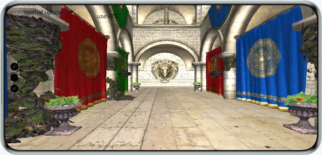

# Upscaling and Adaptative VRS (Vulkan) Capabilities of XEngine Kit

## Overview

In this codelab, you'll learn how to use the GPU spatial upscaling API of XEngine Kit to perform texture upscaling and enable adaptive VRS. The sample code takes drawing the scenes of Sponza Palace as an example, and builds up the Vulkan environment using XComponent. The demo project is created based on the Native C++ template.

## Preview

You can tap the drop-down list box to switch between upscaling modes and tap the check box to enable or disable adaptative VRS. The following figure shows the Sponza Palace scene drawn using XComponent.



## Related Concepts
- [XComponent](https://developer.huawei.com/consumer/en/doc/harmonyos-references/ts-basic-components-xcomponent): The XComponent can accept and display media data input.

## Instructions

1. Run the sample code.
2. Tap the drop-down list box and switch between **no upscale** (no upscaling), **spatial upscale** (GPU spatial upscaling), and **fsr upscale** (FSR1.0 upscaling)  modes.
3. Tap the check box to enable or disable adaptive VRS.

## Project Directory
```
├──entry/src/main	         	// Code area
│  ├──cpp
│  │  ├──types
│  │  │  └──libnativerender
│  │  │    	└──index.d.ts      	// API registration file at the native layer
│  │  ├──napi_init.cpp          // Functions of APIs at the native layer
│  │  ├──CMakeLists.txt         // Compilation configurations at the native layer
│  │  ├──3rdParty               // Third-party component
│  │  ├──common                 // Common APIs
│  │  ├──file                   // File management
│  │  ├──libs                   // Third-party dynamic libraries
│  │  ├──manager                // native & ArkTS interactions
│  │  ├──render                 // Rendering
│  │  └──vulkanbase             // Encapsulated basic Vulkan capabilities
│  ├──ets
│  │  ├──entryability
│  │  │  └──EntryAbility.ts 	// Entry class
│  │  ├──pages
│  │  │  └──index.ets       	// Home screen display class
│  └──resources                 // Directory of resource files
│     ├──base
│     │  └──media
│     │     └──icon.png        	// Image resources
│     └──rawfile
│        └──Sponza
│           └──sponza.obj     	// Model resources
```

## Implementation Details
The sample code uses the following APIs defined in XEngine Kit:
* VKAPI_ATTR VkResult VKAPI_CALL HMS_XEG_EnumerateDeviceExtensionProperties(VkPhysicalDevice physicalDevice, uint32_t* pPropertyCount, XEG_ExtensionProperties* pProperties);
* VKAPI_ATTR VkResult VKAPI_CALL HMS_XEG_CreateSpatialUpscale(VkDevice device, const XEG_SpatialUpscaleCreateInfo*  pXegSpatialUpscaleCreateInfo, XEG_SpatialUpscale* pXegSpatialUpscale);
* VKAPI_ATTR void VKAPI_CALL HMS_XEG_CmdRenderSpatialUpscale(VkCommandBuffer commandBuffer, XEG_SpatialUpscale xegSpatialUpscale, XEG_SpatialUpscaleDescription* pXegSpatialUpscaleDescription);
* VKAPI_ATTR void VKAPI_CALL HMS_XEG_DestroySpatialUpscale(XEG_SpatialUpscale xegSpatialUpscale);
* VKAPI_ATTR VkResult VKAPI_CALL HMS_XEG_CreateAdaptiveVRS(VkDevice device, XEG_AdaptiveVRSCreateInfo* pXegAdaptiveVRSCreateInfo, XEG_AdaptiveVRS* pXegAdaptiveVRS);
* VKAPI_ATTR void VKAPI_CALL HMS_XEG_CmdDispatchAdaptiveVRS(VkCommandBuffer cmdBuffer, XEG_AdaptiveVRS xegAdaptiveVRS, XEG_AdaptiveVRSDescription* pXegAdaptiveVRSDescription);
* VKAPI_ATTR void VKAPI_CALL HMS_XEG_DestroyAdaptiveVRS(XEG_AdaptiveVRS xegAdaptiveVRS);
You can call the APIs listed above to implement upscaling and adaptative VRS.

## Required Permissions

N/A

## Dependency

* This sample code depends on the Assimp third-party component, In this example, the third-party component has been configured and compiled. If you need to replace the third-party component, [compile](https://gitee.com/openharmony-sig/tpc_c_cplusplus/tree/master) it based on the system version. 
* 3D model resources: "[Crytek Sponza](https://casual-effects.com/data/)" by Frank Meinl; Crytek is licensed under [CC BY 3.0](https://creativecommons.org/licenses/by/3.0/)/replace "\\\" with "/" in the **sponza.mtl** file.

## Constraints

1. The sample code can only run on devices with a standard system. Supported devices: For details, see [Hardware Requirements](https://developer.huawei.com/consumer/en/doc/harmonyos-guides/xengine-kit-preparations) in the XEngine Development Guide.
2. This sample demonstrates the stage model, which supports API version 12 or later.
3. HarmonyOS: HarmonyOS NEXT Developer Beta1 or later.
4. DevEco Studio: DevEco Studio NEXT Developer Beta1 or later.
5. HarmonyOS SDK: HarmonyOS NEXT Developer Beta1 SDK or later.
